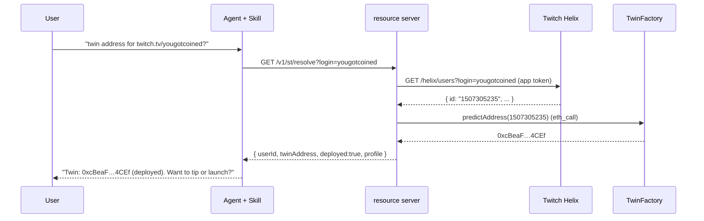
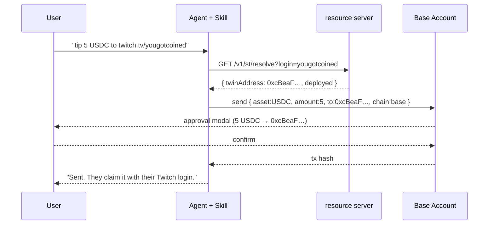
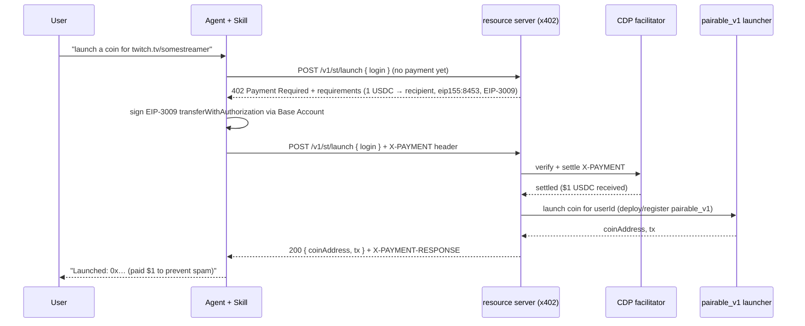

# Architecture

> Design only. See [`README.md`](./README.md) for status.

## Components

```
┌─────────────────────────┐         ┌──────────────────────────────┐
│  Base MCP host           │        │  SocialTwin resource server    │
│  (Claude/ChatGPT/Cursor) │        │  (new routes on wolverine EC2) │
│                          │  HTTP  │                                │
│  • SocialTwin Skill (md) │───────▶│  GET  /v1/st/resolve           │
│  • Base Account wallet   │        │  POST /v1/st/launch  (x402)    │
│  • tools: get_wallets,   │        │  GET  /v1/st/health            │
│    send, send_calls,     │        │                                │
│    web_request, sign     │        │  uses: Twitch Helix API,       │
└───────────┬──────────────┘        │  factory.predictAddress,       │
            │                       │  CDP x402 facilitator,         │
            │  on-chain (Base)      │  pairable_v1 launcher          │
            ▼                       └───────────────┬────────────────┘
┌──────────────────────────┐                       │ on-chain (Base)
│  SocialTwin contracts     │◀──────────────────────┘
│  TwinFactory 0x260C…      │
│  TwitchJWTVerifier 0xBDfC…│
│  twin = predictAddress(id)│
└──────────────────────────┘
```

**The agent never holds our keys.** The Base Account wallet (the user's) signs tips and the x402
payment. Our resource server holds only its own operational keys (Twitch app token; the launcher
deployer key) and never custodies user funds.

## Capability flows

### 1. Resolve (read-only, free)



### 2. Tip (value transfer via Base MCP's native `send`)



Notes:
- **No new contract.** Tip = `send` to the twin address. The existing SocialTwin claim flow
  (Twitch JWT → `execute`) lets the streamer withdraw later.
- **Pre-deploy tips are fine.** The CREATE2 address receives ETH/USDC before the twin exists;
  the streamer deploys + claims afterward. The skill should surface `deployed:false` as
  informational, not a blocker.
- ETH tips: same flow with `asset:ETH`.

### 3. Launch (paid service, x402 — $1 USDC anti-spam)



## x402 path decision (the one real unknown)

x402's "exact" scheme is paid with a signed **EIP-3009 `transferWithAuthorization`** (gasless;
the facilitator submits it), encoded into the `X-PAYMENT` header — **not** a plain ERC-20
transfer. So the open question is *who produces that signed authorization in the Base MCP world*:

| Path | Description | Pick when |
|---|---|---|
| **A — transparent** | Base MCP's client (`web_request` or a built-in x402 capability) follows the 402 itself and signs via Base Account. Skill just calls the endpoint. | Base MCP exposes x402 today. **Preferred.** |
| **B — skill-orchestrated** | Skill reads the 402, uses Base MCP's typed-data signing tool to sign the EIP-3009 authorization, builds `X-PAYMENT`, retries via `web_request`. | Base MCP can sign arbitrary EIP-712 but doesn't auto-follow 402. |
| **C — companion plugin** | A small x402-enabled MCP server (cf. Vercel `x402-mcp`) we run, exposing one `socialtwin_launch` tool that does the 402 dance with its own/connected wallet. | A and B both unavailable; or we want full control of Launch. |

**Decision gate:** validate A → else B → else C. This is [`OPEN_QUESTIONS.md`](./OPEN_QUESTIONS.md) Q1
and **blocks only Launch**. Resolve + Tip ship on the Skill regardless.

We do **not** invent a non-standard "pay then send tx hash as proof" path — it breaks x402
interop and re-introduces the gas/settlement work the facilitator exists to remove.

## Security & trust boundaries

- **No user-fund custody.** We never hold the tip; `send` goes wallet → twin directly. Launch's
  $1 settles wallet → our recipient via the facilitator; we never touch the user's balance beyond
  that authorized amount.
- **Resolve cannot be weaponized.** It's read-only and returns a deterministic address; worst case
  is a wrong Twitch handle → wrong (but still real, claimable-by-that-user) twin. The skill must
  echo the resolved handle + profile back to the user before any send.
- **Launch idempotency / anti-double-charge.** `/launch` must be idempotent per (userId, settled
  payment): if a coin already exists for that streamer, return it **without** charging again
  (verify-before-charge), and never settle twice for one request. See [`API.md`](./API.md).
- **Replay / amount pinning.** Pin the exact `$1` amount, `eip155:8453`, the USDC asset, our
  recipient, and a short expiry in the 402 requirements so a stale authorization can't be reused.
- **Backend keys stay on the EC2.** Twitch app token + launcher deployer key live server-side
  (existing wolverine secret handling), never in the skill or the client.
- **Phishing surface.** The skill is instructions, not a wallet; all value moves go through Base
  Account's approval modal, which shows asset/amount/recipient. The skill must never ask the user
  to paste a private key or seed.

## Networks

- **Staging:** Base Sepolia (`84532`) end-to-end — testnet USDC, a Sepolia factory/verifier, CDP
  facilitator on Sepolia. Keeps mainnet quiet (secrecy).
- **Production:** Base mainnet (`8453`) at cutover.
